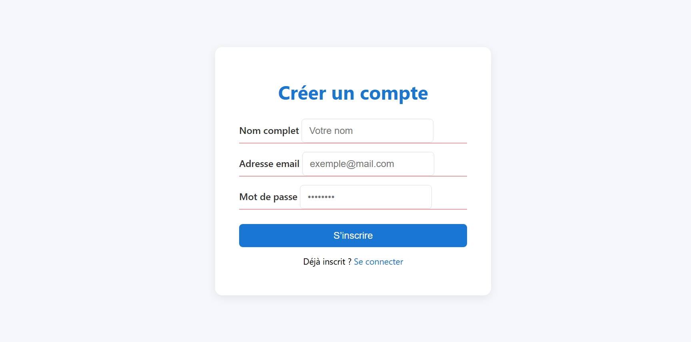
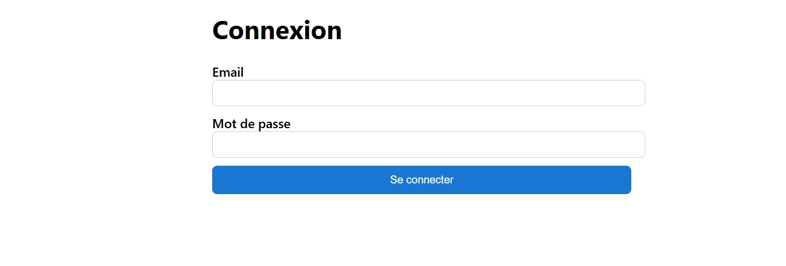
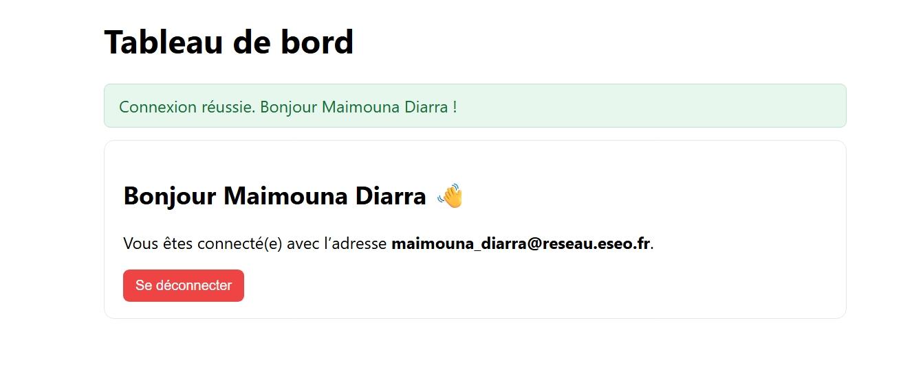

# 🧩 Mini Auth (PHP + MySQL + PDO)

**Projet de la semaine 2–3 du parcours Full-Stack PHP/JS**
Mini application d’authentification sécurisée avec gestion de session, hash de mot de passe et base de données MySQL.

---

## 🖼️ Aperçu du projet

|              Inscription              |             Connexion            |            Tableau de bord           |
| :-----------------------------------: | :------------------------------: | :----------------------------------: |
|  |  |  |

---

## 🚀 Fonctionnalités

* ✅ Inscription avec validation et hashage sécurisé (`password_hash`)
* ✅ Connexion avec vérification (`password_verify`)
* ✅ Sessions persistantes et sécurisées (`session_regenerate_id`)
* ✅ Messages flash (succès/erreur)
* ✅ Protection des pages via `require_auth()`
* ✅ Déconnexion complète avec destruction de session
* ✅ Base de données MySQL (PDO)

---

## ⚙️ Structure du projet

```
/mini-auth
│
├── utils/
│   ├── db.php          → Connexion PDO centralisée
│   ├── boot.php        → Gestion session, flash, redirect, require_auth
│   └── functions.php   → Fonctions utilisateurs (CRUD)
│
├── register.php        → Inscription utilisateur
├── login.php           → Connexion utilisateur
├── dashboard.php       → Page protégée (user connecté)
├── logout.php          → Déconnexion
└── README.md
```

---

## 🧠 Technologies utilisées

* **Backend :** PHP 8+, PDO, Sessions, Password Hash
* **Frontend :** HTML5, CSS3, JavaScript (validation côté client)
* **Base de données :** MySQL

---

## 🗄️ Structure de la base de données

```sql
CREATE TABLE users (
  id INT AUTO_INCREMENT PRIMARY KEY,
  nom VARCHAR(100) NOT NULL,
  email VARCHAR(255) UNIQUE NOT NULL,
  password VARCHAR(255) NOT NULL,
  created_at TIMESTAMP DEFAULT CURRENT_TIMESTAMP
);
```

---

## 🧪 Scénarios de test

1. Inscription → Redirection vers Login → Message succès ✅
2. Login avec mauvais mot de passe → Message erreur ✅
3. Dashboard inaccessible sans session ✅
4. Logout → Redirection + flash “Déconnecté” ✅

---

## 💬 Auteur

Projet réalisé par **Maimouna Diarra**
Étudiante ingénieure (ESEO) — Spécialisation Logiciels & Données
GitHub : [@maimouna-diarra](https://github.com/DiarraMaim01)


